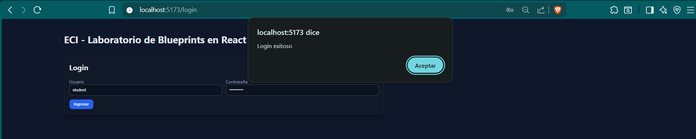
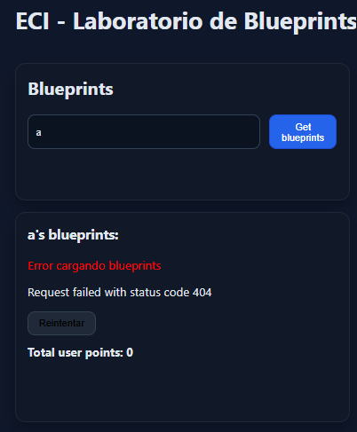
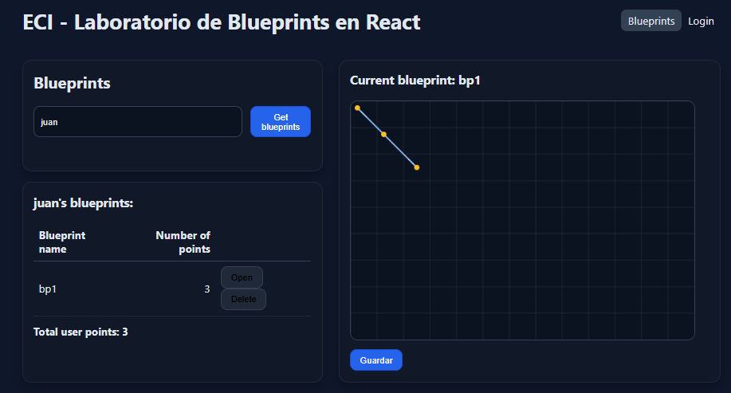
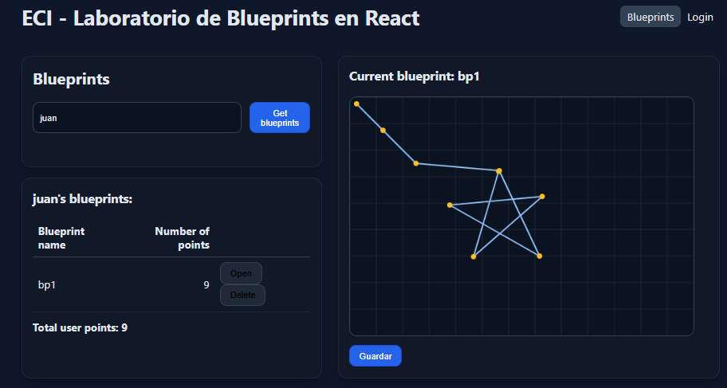

# ARSW Lab 6: React Client for Blueprints (Redux + Axios + JWT)
## Autor: Juan Felipe Ochoa Guerrero

## Parte 1: Actualización de labs pasados
Se agregó un endpoint de Delete en laboratorio 4 y para efectos del lab, se cambió el puerto del lab 5 al 8085.

## Parte 2: Conexión con JWT
Para esta parte, en la página de login se ingresó el endpoint de generación del token. En la imagen se puede ver como 
funciona con el student y clave student123 propuesta en el lab anterior.

## Redux avanzado
Para esta parte se implementaron varios estados en las funciones, estos fueron de espera, de fallo y de success. En la imagen
se ve el estado de fallo para un get blueprint de un autor (se puede ver la implementación del botón de reintentar de la parte de errores y Retry):

Para lo que son delete y update, no se pusieron esos estados, ya que se consideró que no eran relevantes.

## CRUD Completo
Para esta parte se implementó la posibilidad de eliminar un blueprint con un botón cuando aparece el filtro de blueprint
por autor. Al abrirlo y pintarse en el Canvas, también se activa un botón para guardar los puntos hechos.

Como se puede ver, luego de guardar se actualizan los puntos en la UI.

Por último, se agrega el Github Actions propuesto por el ejercicio.
